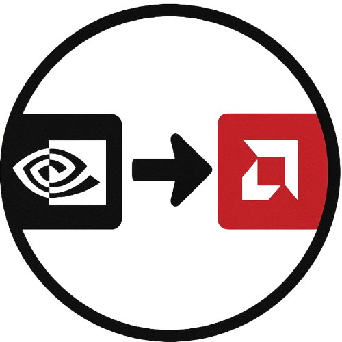
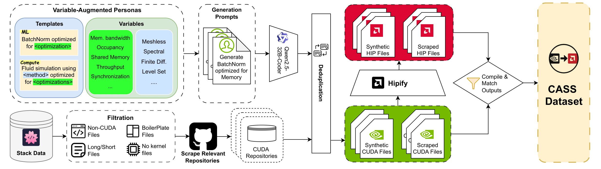

<div align="center">
  
</div>

<div style="margin-top:50px; margin-left: 12%;">
  <h1 style="font-size: 30px; margin: 0;"> CASS: Nvidia to AMD Transpilation with Data, Models, and Benchmark</h1>
</div>


<div align="left" style="margin:24px 0;">
  
</div>

<p align="center">
  <a href="https://arxiv.org/abs/2505.16968"></a>
  <a href="https://huggingface.co/datasets/MBZUAI/cass"></a>
  <a href="https://huggingface.co/collections/ahmedheakl/cass-683efb1596a1dd802de1593a"></a>
</p>

<p align="center">
  <a href="https://www.linkedin.com/in/ahmed-heakl/"><b>Ahmed Heakl</b></a>, 
  <a href="https://www.linkedin.com/in/gustavostahl/"><b>Gustavo Bertolo Stahl</b></a>,
  <a href="https://www.linkedin.com/in/sarim-hashmi-b10b35136/"><b>Sarim Hashmi</b></a>, 
  <a href="https://www.linkedin.com/in/eddieseunghunhan/"><b>Seung Hun Eddie Han</b></a><br> 
  <a href="https://salman-h-khan.github.io/"><b>Salman Khan</b></a>,
   <a href="https://ma3mool.github.io/"><b>Abdulrahman Mahmoud</b></a>,
</p>


<p align="center">
  <b>MBZUAI</b> · <b>Australia National University</b>
</p>

---

## 🆕 Latest Updates

- 📢 **June 2025**: Paper and inference code released!


## Overview

We introduce CASS, the first large-scale dataset and model suite for cross-architecture GPU code transpilation, targeting both source-level (CUDA ↔ HIP) and assembly-level (Nvidia SASS ↔ AMD RDNA3) translation. The dataset comprises 70k verified code pairs across host and device, addressing a critical gap in low-level GPU code portability. Leveraging this resource, we train the CASS family of domain-specific language models, achieving 95% source translation accuracy and 37.5% assembly translation accuracy, substantially outperforming commercial baselines such as GPT-4o, Claude, and Hipify. Our generated code matches native performance in over 85% of test cases, preserving runtime and memory behavior. To support rigorous evaluation, we introduce CASS-Bench, a curated benchmark spanning 16 GPU domains with ground-truth execution. All data, models, and evaluation tools are released as open source to foster progress in GPU compiler tooling, binary compatibility, and LLM-guided hardware translation.


<p align="center">
  
</p>

---

This is the official repository for the CASS: **C**UDA-**A**MD A**ss**embly paper. Since the methodology used to construct our dataset consists of multiple independent modules, we have organized the scripts into separate folders to ensure clarity and modularity. For questions regarding individual components (e.g., Synthetic Pipeline, OpenCL Pipeline), please refer to their respective directories for tailored instructions.

## Hardware setup
Our scripts require a GPU to be present in the user’s machine. The CUDA portion of our pipeline requires an NVIDIA GPU, while the HIP portion requires an AMD GPU. The provided code was tested on an AMD RX 7900, an NVIDIA A100, and an NVIDIA RTX 4090.

## Execution environment 
To ensure reproducibility, we provide a Docker container that manages all dependencies. To build and run it, execute:
```bash
docker build -t transpiler .
docker compose run transpiler
```

## Overview
Here's a breakdown of our folder structure:
* stackv2_scripts: contains code for processing the Stack v2 dataset. Specifically, it fetches all available CUDA files, organizes them according to their original repository file-tree structure, clones repositories with the highest number of CUDA files, and extracts corresponding CPU-GPU assembly
* hipify: includes code for converting CUDA files to HIP using AMD’s HIPify tool.

## Dataset
Our finished dataset processed using the tools available in this repository can be accessed through the following links:
- [Dataset](https://huggingface.co/datasets/MBZUAI/cass)
- [Benchmark](https://huggingface.co/datasets/Sarim-Hash/cass_bench_new_one)
