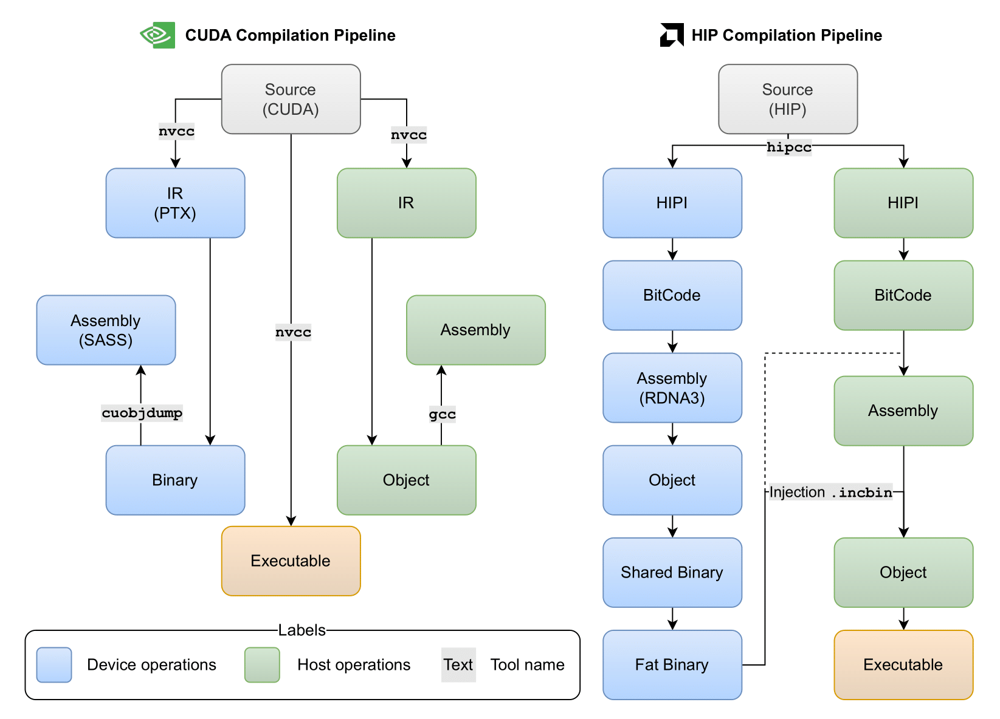
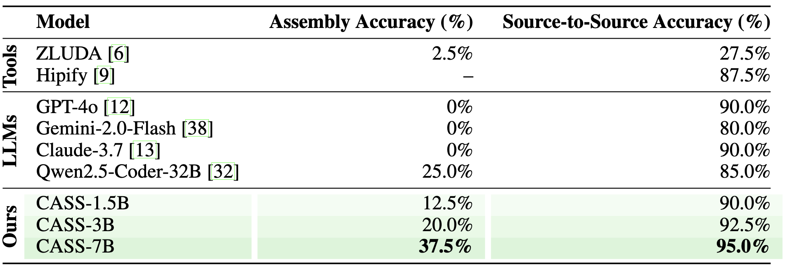

<div align="center">
  
</div>

<div style="margin-top:50px; margin-left: 12%;">
  <h1 style="font-size: 30px; margin: 0;"> CASS: Nvidia to AMD Transpilation with Data, Models, and Benchmark</h1>
</div>


<div align="left" style="margin:24px 0;">
  
</div>

<p align="center">
  <a href="https://gustavostahl.github.io/CASS/"></a>
  <a href="https://arxiv.org/abs/2505.16968"></a>
  <a href="https://huggingface.co/datasets/MBZUAI/cass"></a>
  <a href="https://huggingface.co/collections/ahmedheakl/cass-683efb1596a1dd802de1593a"></a>
</p>

<p align="center">
  <a href="https://www.linkedin.com/in/ahmed-heakl/"><b>Ahmed Heakl</b></a>, 
  <a href="https://www.linkedin.com/in/gustavostahl/"><b>Gustavo Bertolo Stahl</b></a>,
  <a href="https://www.linkedin.com/in/sarim-hashmi-b10b35136/"><b>Sarim Hashmi</b></a>, 
  <a href="https://www.linkedin.com/in/eddieseunghunhan/"><b>Seung Hun Eddie Han</b></a><br> 
  <a href="https://salman-h-khan.github.io/"><b>Salman Khan</b></a>,
   <a href="https://ma3mool.github.io/"><b>Abdulrahman Mahmoud</b></a>,
</p>


<p align="center">
  <b>MBZUAI</b> · <b>Australia National University</b>
</p>

---

## 🆕 Latest Updates

- 📢 **June 2025**: Paper and inference code released!

## Table of Contents
- [🧠 Overview](#-overview)
- [🏗️ Data Construction Pipeline](#%EF%B8%8F-data-construction-pipeline)
- [📊 Results](#-results)
- [🧪 Inference](#-inference)
- [📚 Citation](#-citation)


## 🧠 Overview

We introduce CASS, the first large-scale dataset and model suite for cross-architecture GPU code transpilation, targeting both source-level (CUDA ↔ HIP) and assembly-level (Nvidia SASS ↔ AMD RDNA3) translation. The dataset comprises 70k verified code pairs across host and device, addressing a critical gap in low-level GPU code portability. Leveraging this resource, we train the CASS family of domain-specific language models, achieving 95% source translation accuracy and 37.5% assembly translation accuracy, substantially outperforming commercial baselines such as GPT-4o, Claude, and Hipify. Our generated code matches native performance in over 85% of test cases, preserving runtime and memory behavior. To support rigorous evaluation, we introduce CASS-Bench, a curated benchmark spanning 16 GPU domains with ground-truth execution. All data, models, and evaluation tools are released as open source to foster progress in GPU compiler tooling, binary compatibility, and LLM-guided hardware translation.


<p align="center">
  
</p>

---


## 🏗️ Data Construction Pipeline
Since the methodology used to construct our dataset consists of multiple independent modules, we have organized the scripts into separate folders to ensure clarity and modularity. For questions regarding individual components (e.g., Synthetic Pipeline, OpenCL Pipeline), please refer to their respective directories for tailored instructions.

### 🧵 Compiler Stack

<p align="center">
  
</p>


> The Nvidia (left) and AMD (right) stacks illustrate the compilation process for CUDA and HIP. Blue denotes device-side steps; green denotes host-side steps. Nvidia’s stack is opaque; accessing device assembly (SASS) requires first compiling to binary, then using cuobjdump. In contrast, AMD’s process is transparent, allowing direct inspection and modification of device assembly (RDNA3) before host integration.

### 💻 Hardware setup
Our scripts require a GPU to be present in the user’s machine. The CUDA portion of our pipeline requires an NVIDIA GPU, while the HIP portion requires an AMD GPU. The provided code was tested on an AMD RX 7900, an NVIDIA A100, and an NVIDIA RTX 4090.

### 🐳 Execution environment 
To ensure reproducibility, we provide a Docker container that manages all dependencies. To build and run it, execute:
```bash
docker build -t transpiler .
docker compose run transpiler
```

### 📁 Subfolders
Here's a breakdown of our folder structure:
* `stackv2_scripts`: contains code for processing the Stack v2 dataset. Specifically, it fetches all available CUDA files, organizes them according to their original repository file-tree structure, clones repositories with the highest number of CUDA files, and extracts corresponding CPU-GPU assembly
* `hipify`: includes code for converting CUDA files to HIP using AMD’s HIPify tool.

### 📦 Generated Data
Refer to [Huggingface Dataset and Benchmark](https://huggingface.co/datasets/MBZUAI/cass) for details on how to load the dataset and benchmark.

## 📊 Results

<p align="center">
  
</p>

> Performance of different models on our CASS-Bench. Bold cells refer to the best results.


## 🧪 Inference
We provide a simple inference script to run the CASS models. The script supports both source-to-source and assembly-to-assembly translation. 

### 🧠 Available Models
We provide multiple models with multiple parameter scales.
<table border="1" cellpadding="6" cellspacing="0">
  <tr>
    <th>Model</th>
    <th>Type</th>
    <th>Link</th>
  </tr>
  <tr>
    <td>CASS-src-1.5B</td>
    <td rowspan="3">Source-to-Source</td>
    <td><a href="https://huggingface.co/ahmedheakl/cass-src-1.5b">HuggingFace</a></td>
  </tr>
  <tr>
    <td>CASS-src-3B</td>
    <td><a href="https://huggingface.co/ahmedheakl/cass-src-3b">HuggingFace</a></td>
  </tr>
  <tr>
    <td>CASS-src-7B</td>
    <td><a href="https://huggingface.co/ahmedheakl/cass-src-7b">HuggingFace</a></td>
  </tr>
  <tr>
    <td>CASS-smA100-1.5B</td>
    <td rowspan="3">Assembly-to-Assembly (sm_80, A100)</td>
    <td><a href="https://huggingface.co/ahmedheakl/cass-smA100-1.5b">HuggingFace</a></td>
  </tr>
  <tr>
    <td>CASS-smA100-3B</td>
    <td><a href="https://huggingface.co/ahmedheakl/cass-smA100-3b">HuggingFace</a></td>
  </tr>
  <tr>
    <td>CASS-smA100-7B</td>
    <td><a href="https://huggingface.co/ahmedheakl/cass-smA100-7b">HuggingFace</a></td>
  </tr>
  <tr>
    <td>CASS-sm4090-1.5B</td>
    <td rowspan="3">Assembly-to-Assembly (sm_89, RTX4090)</td>
    <td><a href="https://huggingface.co/ahmedheakl/cass-sm4090-1.5b">HuggingFace</a></td>
  </tr>
  <tr>
    <td>CASS-sm4090-3B</td>
    <td><a href="https://huggingface.co/ahmedheakl/cass-sm4090-3b">HuggingFace</a></td>
  </tr>
  <tr>
    <td>CASS-sm4090-7B</td>
    <td>TBR</td>
  </tr>
</table>


### ⚙️ Usage
To run inference, you just need `transformers` and `torch` installed. Here is a simple example of how to run inference using the CASS models:

- Source-to-Source Translation (CUDA ↔ HIP):
```python
from transformers import AutoModelForCausalLM, AutoTokenizer

model_name = "ahmedheakl/cass-src-3b" # replace with other models (1.5B, 7B) as needed
model = AutoModelForCausalLM.from_pretrained(
    model_name,
    torch_dtype="auto",
    device_map="auto",
    # attn_implementation="flash_attention_2", uncomment if you have flash attention 2 installed
)
tokenizer = AutoTokenizer.from_pretrained(model_name)
cuda_code = """
#include <stdio.h>
__global__ void add(int *a, int *b, int *c) {
    int idx = threadIdx.x + blockIdx.x * blockDim.x;
    c[idx] = a[idx] + b[idx];
}
int main() {
    int a[5] = {1, 2, 3, 4, 5};
    int b[5] = {10, 20, 30, 40, 50};
    int c[5];
    int *d_a, *d_b, *d_c;
    cudaMalloc((void**)&d_a, 5 * sizeof(int));
    cudaMalloc((void**)&d_b, 5 * sizeof(int));
    cudaMalloc((void**)&d_c, 5 * sizeof(int));  
    cudaMemcpy(d_a, a, 5 * sizeof(int), cudaMemcpyHostToDevice);
    cudaMemcpy(d_b, b, 5 * sizeof(int), cudaMemcpyHostToDevice
    );
    add<<<1, 5>>>(d_a, d_b, d_c);
    cudaMemcpy(c, d_c, 5 * sizeof(int), cudaMemcpyDeviceToHost
    );
    for (int i = 0; i < 5; i++) {
        printf("%d ", c[i]);    
    }
    cudaFree(d_a);
    cudaFree(d_b);
    cudaFree(d_c);
    return 0;
}
"""

prompt = f"Convert the following CUDA code to AMD GPU code:\n```cuda\n{cuda_code}\n```"
messages = [
    {"role": "user", "content": prompt}
]
text = tokenizer.apply_chat_template(
    messages,
    tokenize=False,
    add_generation_prompt=True
)
model_inputs = tokenizer([text], return_tensors="pt").to(model.device)

print("Generating AMD code...")
generated_ids = model.generate(
    **model_inputs,
    max_new_tokens=4096,
)
generated_ids = [
    output_ids[len(input_ids):] for input_ids, output_ids in zip(model_inputs.input_ids, generated_ids)
]

response = tokenizer.batch_decode(generated_ids, skip_special_tokens=True)[0]
amd_code = response.split("```amd")[-1].split("```")[0]
print("Converted AMD Code:\n", amd_code)
```

- Assembly-to-Assembly Translation (SASS ↔ RDNA3):
```python
from transformers import AutoModelForCausalLM, AutoTokenizer

model_name = "ahmedheakl/cass-smA100-3b" # replace with other models (1.5B, 7B) or (sm4090) as needed
model = AutoModelForCausalLM.from_pretrained(
    model_name,
    torch_dtype="auto",
    device_map="auto",
    # attn_implementation="flash_attention_2", uncomment if you have flash attention 2 installed
)
tokenizer = AutoTokenizer.from_pretrained(model_name)
cuda_device_assembly = """code for sm_80
Function : _Z3addPiS_S_i
.headerflags @"EF_CUDA_TEXMODE_UNIFIED EF_CUDA_64BIT_ADDRESS EF_CUDA_SM80 EF_CUDA_VIRTUAL_SM(EF_CUDA_SM80)"
/*0000*/ MOV R1, c[0x0][0x28] ; /* 0x00000a0000017a02 */
/* 0x000fc40000000f00 */
/*0010*/ S2R R6, SR_TID.X ; /* 0x0000000000067919 */
/* 0x000e280000002100 */
/*0020*/ S2R R3, SR_CTAID.X ; /* 0x0000000000037919 */
/* 0x000e240000002500 */
/*0030*/ IMAD R6, R3, c[0x0][0x0], R6 ; /* 0x0000000003067a24 */
/* 0x001fca00078e0206 */
/*0040*/ ISETP.GE.AND P0, PT, R6, c[0x0][0x178], PT ; /* 0x00005e0006007a0c */
/* 0x000fda0003f06270 */
/*0050*/ @P0 EXIT ; /* 0x000000000000094d */
/* 0x000fea0003800000 */
/*0060*/ HFMA2.MMA R7, -RZ, RZ, 0, 2.384185791015625e-07 ; /* 0x00000004ff077435 */
/* 0x000fe200000001ff */
/*0070*/ ULDC.64 UR4, c[0x0][0x118] ; /* 0x0000460000047ab9 */
/* 0x000fd20000000a00 */
/*0080*/ IMAD.WIDE R4, R6, R7, c[0x0][0x168] ; /* 0x00005a0006047625 */
/* 0x000fc800078e0207 */
/*0090*/ IMAD.WIDE R2, R6.reuse, R7.reuse, c[0x0][0x160] ; /* 0x0000580006027625 */
/* 0x0c0fe400078e0207 */
/*00a0*/ LDG.E R4, [R4.64] ; /* 0x0000000404047981 */
/* 0x000ea8000c1e1900 */
/*00b0*/ LDG.E R3, [R2.64] ; /* 0x0000000402037981 */
/* 0x000ea2000c1e1900 */
/*00c0*/ IMAD.WIDE R6, R6, R7, c[0x0][0x170] ; /* 0x00005c0006067625 */
/* 0x000fe200078e0207 */
/*00d0*/ IADD3 R9, R4, R3, RZ ; /* 0x0000000304097210 */
/* 0x004fca0007ffe0ff */
/*00e0*/ STG.E [R6.64], R9 ; /* 0x0000000906007986 */
/* 0x000fe2000c101904 */
/*00f0*/ EXIT ; /* 0x000000000000794d */
/* 0x000fea0003800000 */
/*0100*/ BRA 0x100; /* 0xfffffff000007947 */
/* 0x000fc0000383ffff */
/*0110*/ NOP; /* 0x0000000000007918 */
/* 0x000fc00000000000 */
/*0120*/ NOP; /* 0x0000000000007918 */
/* 0x000fc00000000000 */
/*0130*/ NOP; /* 0x0000000000007918 */
/* 0x000fc00000000000 */
/*0140*/ NOP; /* 0x0000000000007918 */
/* 0x000fc00000000000 */
/*0150*/ NOP; /* 0x0000000000007918 */
/* 0x000fc00000000000 */
/*0160*/ NOP; /* 0x0000000000007918 */
/* 0x000fc00000000000 */
/*0170*/ NOP; /* 0x0000000000007918 */
/* 0x000fc00000000000 */
/*0180*/ NOP; /* 0x0000000000007918 */
/* 0x000fc00000000000 */
/*0190*/ NOP; /* 0x0000000000007918 */
/* 0x000fc00000000000 */
/*01a0*/ NOP; /* 0x0000000000007918 */
/* 0x000fc00000000000 */
/*01b0*/ NOP; /* 0x0000000000007918 */
/* 0x000fc00000000000 */
/*01c0*/ NOP; /* 0x0000000000007918 */
/* 0x000fc00000000000 */
/*01d0*/ NOP; /* 0x0000000000007918 */
/* 0x000fc00000000000 */
/*01e0*/ NOP; /* 0x0000000000007918 */
/* 0x000fc00000000000 */
/*01f0*/ NOP; /* 0x0000000000007918 */
/* 0x000fc00000000000 */
..........
"""

device_prompt = f"""Convert the following CUDA device assembly code to HIP device assembly:\n```cudaasm\n{cuda_device_assembly}\n```"""
messages = [
    {"role": "user", "content": device_prompt}
]
text = tokenizer.apply_chat_template(
    messages,
    tokenize=False,
    add_generation_prompt=True
)
model_inputs = tokenizer([text], return_tensors="pt").to(model.device)

print("Generating AMD device code...")
generated_ids = model.generate(
    **model_inputs,
    max_new_tokens=4096,
)
generated_ids = [
    output_ids[len(input_ids):] for input_ids, output_ids in zip(model_inputs.input_ids, generated_ids)
]

response = tokenizer.batch_decode(generated_ids, skip_special_tokens=True)[0]
print(response)
amd_code = response.split("```hipasm")[-1].split("```")[0]
print("Converted AMD Device Code:\n", amd_code)
```

## ✅ Todos

- [ ] Release training code
- [ ] Release evaluation scripts


## 📚 Citation
If you are using CASS in your research or application, please cite us using this BibTeX:

```bibtex
@article{heakl2025cass,
  title={CASS: Nvidia to AMD Transpilation with Data, Models, and Benchmark},
  author={Heakl, Ahmed and Hashmi, Sarim and Stahl, Gustavo Bertolo and Han, Seung Hun Eddie and Khan, Salman and Mahmoud, Abdulrahman},
  journal={arXiv preprint arXiv:2505.16968},
  year={2025}
}
```